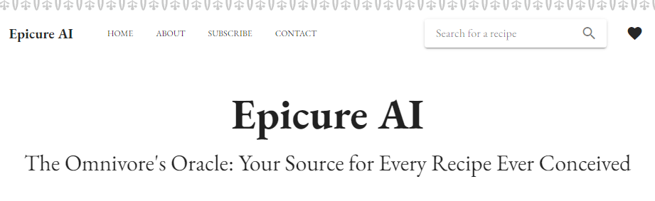
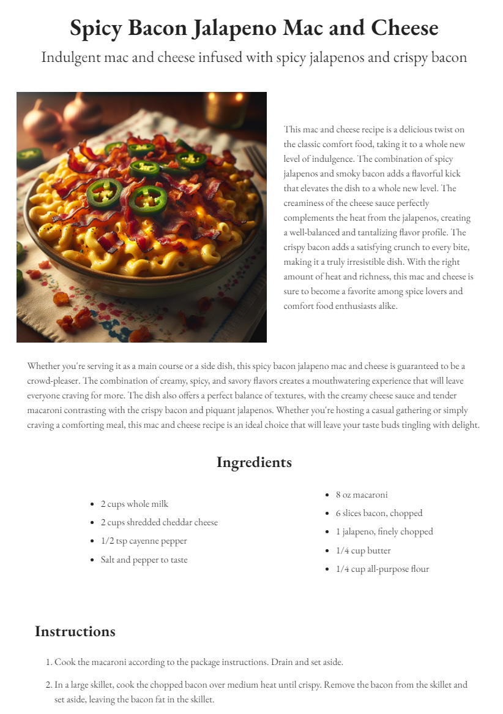
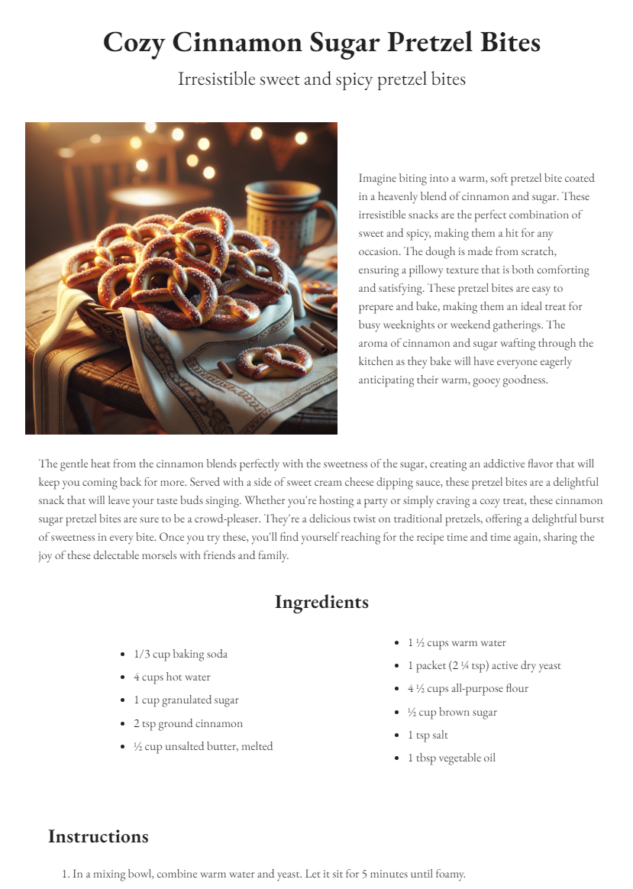
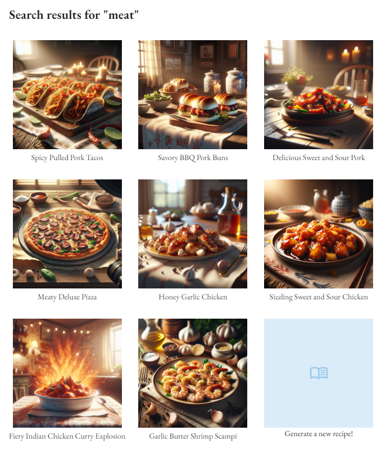

# Epicure AI

An AI blog that contains all recipes! Simply search for a food or drink and a full recipe complete with pictures will be created for you on the spot! Fork this repo and follow the setup instructions below
to try this out yourself. Also take a look at my <a href='https://capsncrunch.github.io/articles/epicure-ai.html' target='_blank'>article</a> covering the details of the implementation, a creative use of OpenAI's API to
enable a cheap but powerful search function, and some other stuff I learned along the way developing my first AI-supported website!

## Project setup

### Client Side

In the client folder, run `npm install`.

### Server Side

In the server folder, create a `.env` file with the following structure:

```
NODE_ENV=development
PORT=3000
OPENAI_API_KEY=<YOUR_OPEN_AI_API_KEY>
FIREBASE_CONFIG=<YOUR_JSON_STRINGIFIED_FIREBASE_CONFIG>
```

For example, my firebase config looks like `{ "apiKey": "...", "authDomain": "...", "projectId": "...", "storageBucket": "...", ... }`.

Be sure to load some credits onto your OpenAI account. Recipe generation only costs around $0.05 per recipe, so you should not need to start with more than $5.

Also run `npm install`.

## Running Locally

In the client, run `npm run dev`. In a separate terminal, in the server folder, run `node app.js`.

Open <a href="http://localhost:8080">http://localhost:8080</a> and get started making recipes!

##

<br />
<p align='center'>
  
</p>

<p align='center'>
  
</p>

<p align='center'>
  
  
</p>

<p align='center'>
  
</p>
